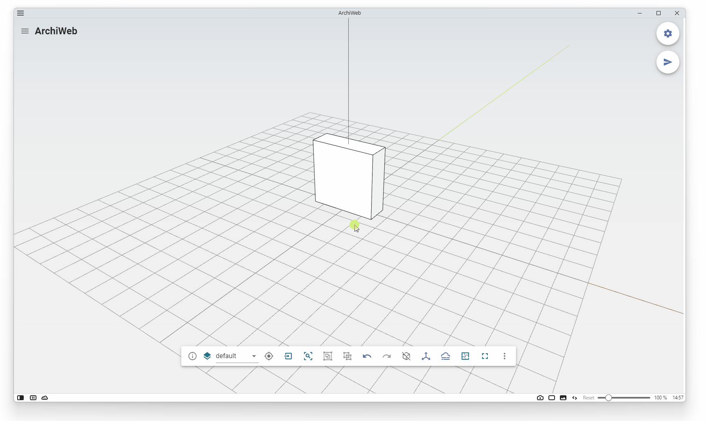

# IP Layout

This is a small application that transfer the configured <b>templates</b> and <b>box domains</b> to the backend and generate the corresponding grid layout.     The backend is Hua Hao's <a target="_blank" href="https://github.com/whitegreen/PackingDone">pack-grid</a> with 0-1 integer linear programming via <a target="_blank" href="https://www.gurobi.com/">Gurobi</a> Python.

